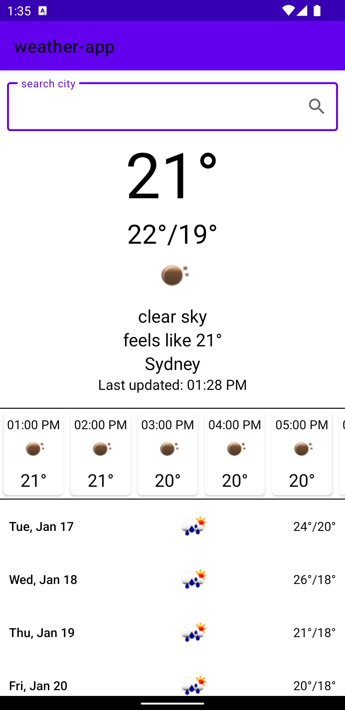

# weather-app
> An asynchronous MVVM Android-application written in Kotlin, using [openweathermap's](https://openweathermap.org) **API**.
> 
> View [_here_](https://github.com/michigang1/weather-app/tree/main/app/src/main). 
-------------------------------
## Contents
* [General Info](#general-information)
* [Technologies Used](#technologies-used)
* [Screenshots](#screenshots)
* [Setup](#setup) <!-- * [Usage](#usage) -->
* [Project Status](#project-status)
* [Room for Improvement](#room-for-improvement)
* [Acknowledgements](#acknowledgements)
* [Contact](#contact)<!-- * [License](#license) -->


## General Information
- Thay application is a simple weather-app.
- It receives data from the opentweathermap's server on requests to its API.
- With the help of my application you can find out the weather for a day or next week in the any city.


## Technologies Used
- **IDE**: IntelliJ IDEA
- **Language**: Kotlin
- **Build system**: Gradle
- **Architecture**: MVVM
- **Other instruments**:
   - Dagger2
   - Retrofit2
   - AdnroidX
   - Kotlin Coroutines
   - Glide
   - API


## Screenshots
|            1            |             2             |             3              |  
|:-----------------------:|:-------------------------:|:--------------------------:| 
|  |  |   |

## Setup
 
 ### Enter in IDE's Terminal:
 1) `git clone https://github.com/michigang1/weather-app.git`
 2) `gradle build`
 3) `gradle run`
 
 ### Requirments:
 -SDK: 32
 
 ### Dependecies:
 ```kotlin
    implementation 'androidx.core:core-ktx:1.9.0'
    implementation 'androidx.appcompat:appcompat:1.5.1'
    implementation 'com.google.android.material:material:1.7.0'
    implementation 'androidx.constraintlayout:constraintlayout:2.1.4'
    implementation 'androidx.lifecycle:lifecycle-livedata-ktx:2.5.1'
    implementation 'androidx.lifecycle:lifecycle-viewmodel-ktx:2.5.1'
    implementation "androidx.fragment:fragment-ktx:1.5.5"
    testImplementation 'junit:junit:4.13.2'
    androidTestImplementation 'androidx.test.ext:junit:1.1.5'
    androidTestImplementation 'androidx.test.espresso:espresso-core:3.5.1'

    // Coroutines
    implementation 'org.jetbrains.kotlinx:kotlinx-coroutines-android:1.6.4'
    implementation 'org.jetbrains.kotlinx:kotlinx-coroutines-android:1.6.4'

    // Dagger2
    implementation 'com.google.dagger:dagger-android:2.44.2'
    implementation 'com.google.dagger:dagger-android-support:2.44.2'
    implementation 'com.google.dagger:dagger:2.44.2'
    kapt 'com.google.dagger:dagger-compiler:2.44.2'
    kapt 'com.google.dagger:dagger-android-processor:2.44.2'
    kapt 'org.jetbrains.kotlinx:kotlinx-metadata-jvm:0.5.0'

    // ViewBindingDelegate
    implementation 'com.github.kirich1409:viewbindingpropertydelegate:1.5.6'

    // Retrofit 2
    implementation 'com.squareup.retrofit2:retrofit:2.9.0'
    implementation 'com.squareup.retrofit2:converter-gson:2.9.0'
    implementation 'com.squareup.retrofit2:adapter-rxjava2:2.9.0'

    // Glide
    implementation 'com.github.bumptech.glide:glide:4.12.0'
    kapt 'com.github.bumptech.glide:compiler:4.12.0'
 ```

## Project Status
Project is: _in progress_


## Room for Improvement

In progres:
- Displaying weather by current users's location.

Also offer your ideas in the https://github.com/michigang1/weather-app/discussions


## Acknowledgements
- This project was inspired by my lecturer [Timur Shemsedinov](https://github.com/HowProgrammingWorks/Index/commits?author=tshemsedinov)
<!-- - This project was based on [this tutorial](https://www.example.com). -->


## Contact
Created by Michael Chirozidi - [my telegram](https://telegram.me/poor_boy) - feel free to contact me!


## License
[MIT](LICENSE.md)
